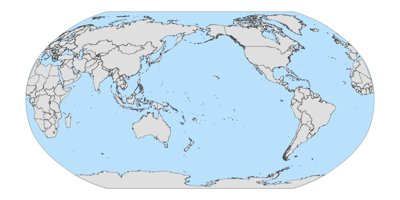

<!-- README.md is generated from README.Rmd. Please edit that file -->

```{r, include = FALSE}
knitr::opts_chunk$set(
  collapse = TRUE,
  comment = "#>",
  fig.path = "man/figures/README-",
  out.width = "100%"
)
```

# shiftCenterWorldMap

<!-- badges: start -->
[](https://zenodo.org/badge/latestdoi/692045656)
<!-- badges: end -->

The goal of shiftCenterWorldMap is to vizualize a fish-eyed world (robinson projection) with the center of the map on your area of interest. The edge of region is also densify with st_segmentize. [shift center world map along equator]



## Installation

You can install the development version of shiftCenterWorldMap from [GitHub](https://github.com/thehung92/shiftCenterWorldMap) with:

``` r
# install.packages("devtools")
devtools::install_github("thehung92/shiftCenterWorldMap")
```

## Example

Create world map in robinson project with the center at lon:lat=100:0 and plot with ggplot. If the code does not work, try to read the error message and see which library is not installed in your environment and try to install them with `install.packages()`

```{r world}
library(shiftCenterWorldMap)
library(ggplot2)
library(sf)
## basic example code
center = 100
sf.world = create_world_map_custom_center(center)
ggplot() +
  geom_sf(data = sf.world)
```

You can see that the world map has a fish-eye shaped but the plot panel is still a rectangle. Therefore, you cannot fill the color of the ocean normally with theme(panel.background) because that method will fill the whole rectangle with blue. What we want is a fish-eyed shape polygon that we can plot as background before adding the worldmap layer.

```{r ocean}
sf.ocean = create_ocean_background(center)
# declare the robinson project with shifted center
myCrs = paste0('+proj=robin +lon_0=', center, ' +x_0=0 +y_0=0 +ellps=WGS84 +datum=WGS84')
# the coord_sf is super important because
## you need to declare coordinate reference system (CRS) you want to plot for all layers
## you also need to declare the default crs 4326 so that ggplot know to interpret the non-sf layer as degree and in the lon:lat=0:0 degree.
map = ggplot() +
  geom_sf(data = sf.ocean, fill ="lightskyblue", alpha = 0.5) +
  geom_sf(data = sf.world) +
  coord_sf(crs = myCrs, default_crs = st_crs(4326)) +
  theme(panel.background = element_blank(),
        axis.ticks = element_blank(),
        axis.text = element_blank())
map
```

Sometime, you want to have the graticule grid so you have some idea about the coordinate of the location you are looking at

```{r theme}
map2 = map +
  # custom grid line every 20degree longitude and every 10 degree latitude
  scale_x_continuous(breaks = seq(-180, 180, 20)) +
  scale_y_continuous(breaks = seq(-90, 90, 10)) +
  theme(panel.grid = element_line(colour = "deepskyblue",
                                  linetype = 3,
                                  linewidth = 0.2))
map2
```

the end result is a ggplot object and you should be able to save it to file with ggsave
